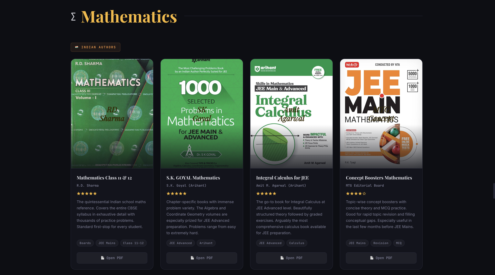

</head>
<body>

<h1>PROJECT TITLE: PageVault"</h1>

<h3>AUTHOR : ATHARV ANAND</h3>

 

<h2>How To Use The Website</h2>

  It's very easy just open the website and you will see website headpage with its purpose to solve and 4 subjects (PCMB)
  
  

   
After clciking on any subject or you can scroll down you can see the list of books with separated sections on the basis of author origin , click on any book open pdf feature and you can directly see the ebook .

<h3>Why I made this website ?</h3>

  I made this website because during my competitive exam and olympiads preparation I found it very difficult to get each and every book on my table or some are costly too especially Foreign authors and if I tried to get the e book pdf there were many discrepancy , so to solve this issue I created this PageVault which has all books at a single place with their details and direct book open pdf feature .

<h2>Some cool features</h2>

<ul>
  <li> Simple and plain dark UI</li>
  <li>Contains books across 4 major Domains of STEM i.e. physics , chemistry , mathematics and biology.</li>
  <li>Both Indian and Foreign authors books are there with separated section in each subject </li>
  <li>Each book has its ratings , reviews and cover page </li>
  <li>All books have a open pdf feature in which direct pdf of book can be accessed </li>
</ul>

<h3> AI use </h3>

I used AI for all the content,review/description and book research work  

<h2>TECH STACK</h2>

 

 

  
</li>
  

</li>
</ul>
</body>
</html>

